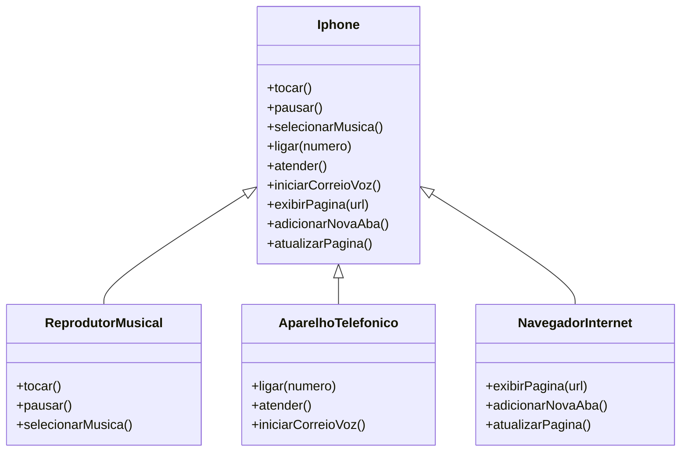

## POO - Desafio Concluído

### Modelagem e Implementação de um Componente iPhone  

Neste desafio, foi modelado e implementado um componente iPhone em Java, abrangendo suas funcionalidades como Reprodutor Musical, Aparelho Telefônico e Navegador na Internet.  

#### 📌 Tecnologias e Ferramentas Utilizadas  
- **Java** para implementação das classes e interfaces.  
- **Mermaid.js** para a criação do diagrama UML.  
- **Astah** para modelagem UML.  

#### 📌 Estrutura do Projeto  
Foi criado um diagrama UML para representar a relação entre a classe `Iphone` e as interfaces:  

- **`ReprodutorMusical`**  
  - Métodos: `tocar()`, `pausar()`, `selecionarMusica(String musica)`  
- **`AparelhoTelefonico`**  
  - Métodos: `ligar(String numero)`, `atender()`, `iniciarCorreioVoz()`  
- **`NavegadorInternet`**  
  - Métodos: `exibirPagina(String url)`, `adicionarNovaAba()`, `atualizarPagina()`  

#### 📌 Diagrama UML  



## Como Executar o Programa  

### 📌 Pré-requisitos  
Certifique-se de ter instalado:  
- **Java JDK 8+**  
- **Um ambiente de desenvolvimento Java** (Eclipse, IntelliJ IDEA ou VS Code com extensão para Java)  

### 📌 Passos para Execução  

1. **Clone o repositório**  
   ```
   git clone https://github.com/seu-usuario/seu-repositorio.git
   cd seu-repositorio
2. **Compile os arquivos Java**
   No terminal, dentro da pasta do projeto, execute:

   ```
   javac *.java
3. **Execute o programa**
   ```
   java Main

